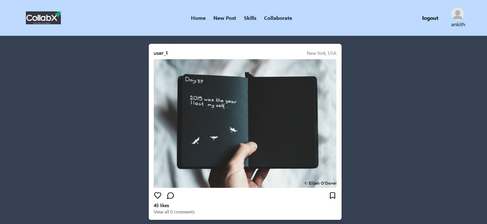
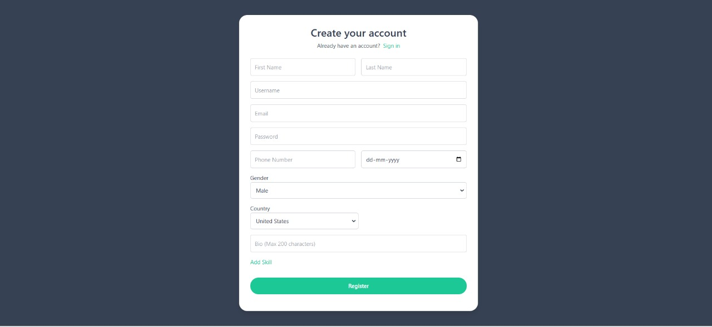
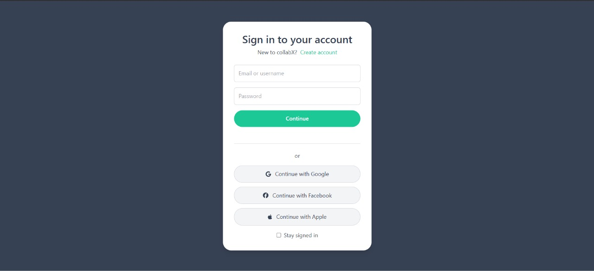
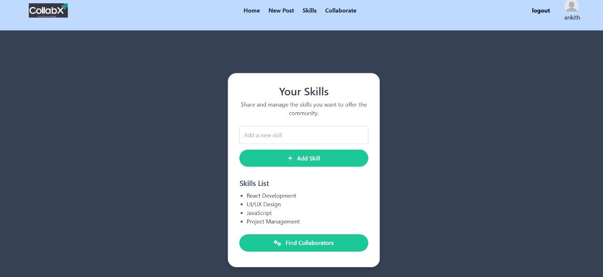
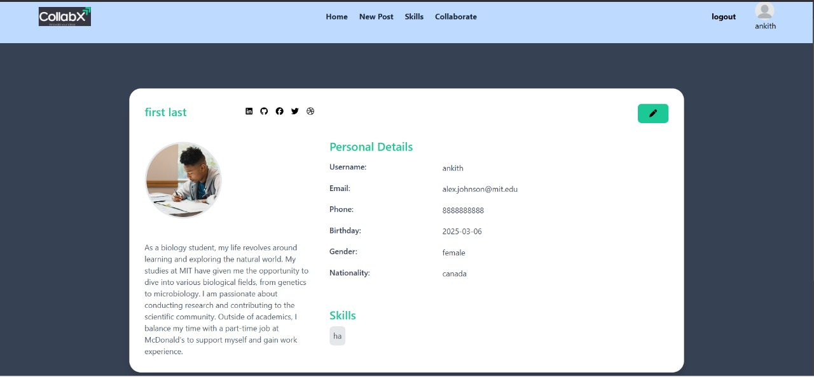
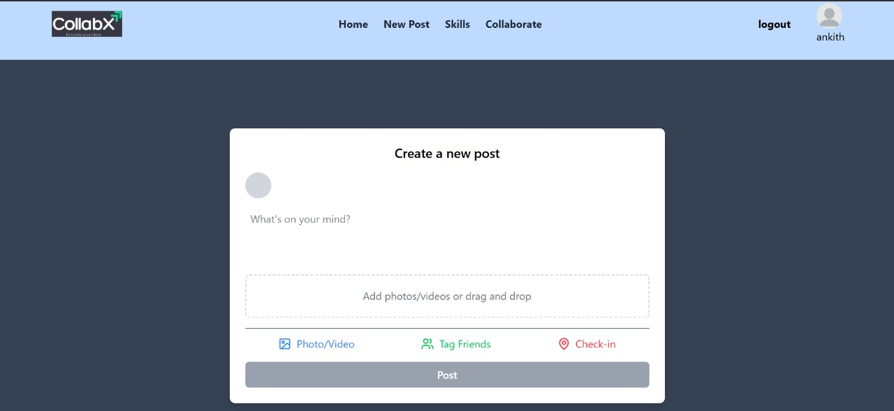

# CollabX

## Introduction
**CollabX** is a collaborative platform where users can post their ideas, comment on posts, share skills, and collaborate with others. It is designed to bring together like-minded individuals to work on innovative projects and build a strong professional network.

## Deployed App
[Live Demo](collaabx-taffy-2a2cf9.netlify.app)


## Features
- **Post Ideas**: Users can share their project ideas and receive feedback.
- **Comment & Engage**: Interact with posts through comments and discussions.
- **Skill Sharing**: Connect with others based on shared skills and interests.
- **Collaboration**: Find team members for projects and work together seamlessly.
- **User Authentication**: Secure sign-in and profile management.

## Glimpse and Screenshots of our cloned website:
<table>
  <tr align=center>
    <td>Landing Page</td>
    <td>Register Page</td>
    <td>Signin Page</td>
   </tr>
    <tr align=center>
      <td>Skills Page</td>
    <td>Profiles Page</td>
    <td>Collobrate Page </td>
  </tr> 
</table>


## Technology Stack
- **Frontend**: React
- **Backend**: Node.js, Express.js
- **Database**: MongoDB
- **Authentication**: JWT-based authentication for secure access

## Installation & Getting Started
### Prerequisites
- Node.js installed
- MongoDB setup
- A code editor (VS Code, Sublime Text, etc.)

## Installation & Getting Started
### Prerequisites
- Node.js installed
- MongoDB setup
- A code editor (VS Code, Sublime Text, etc.)
- Git installed

### Steps to Run Locally

#### Clone the Repository
```sh
https://github.com/ankithmandal09/CollabX.git
cd collabx
```

### Setting Up the Frontend
1. Navigate to the frontend directory:
   ```sh
   cd frontend
   ```
2. Install dependencies:
   ```sh
   npm install
   ```
3. Start the development server:
   ```sh
   npm start
   ```

### Setting Up the Backend
1. Navigate to the backend directory:
   ```sh
   cd backend
   ```
2. Install dependencies:
   ```sh
   npm install
   ```
   
4. Start the backend server:
   ```sh
   npm start
   ```
5. The backend will run at `http://localhost:8090/` by default.

---

 ⁍ **Ankith Mandal**:
 - Linkedin: www.linkedin.com/in/ankith-mandal-030296276
   
 ⁍ **Raj Ghosh**:
 - https://www.linkedin.com/in/raj-ghosh-codezilla/
   
 ⁍ **Bharath Raj**:
 - Linkedin: https://www.linkedin.com/in/bharathrajs1807

## Show your support

Give a ⭐️ if you like this project!
